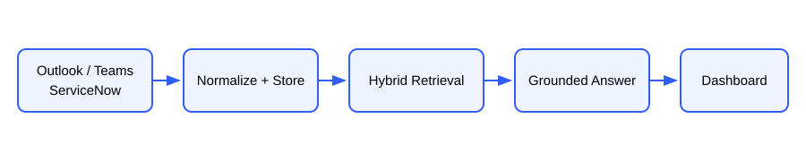

# Enterprise Knowledge Assistant

An offline-first reference application that normalizes knowledge from Outlook, Teams, and ServiceNow, applies group-aware retrieval, and produces answers with record citations. Local mode makes no network calls; Azure mode uses Microsoft Graph, Blob Storage, Azure AI Search, and Azure OpenAI.



## Local quick start

```powershell
python -m venv .venv
.\.venv\Scripts\Activate.ps1
python -m pip install -r requirements.txt
python -m pip install -e .
$env:APP_MODE="local"
pytest
eka demo
eka config-check
eka ingest
eka ask "What critical incident needs attention?" --groups employees,engineering
eka notify --channel local
eka export-powerbi
python -m streamlit run streamlit_app.py
```

Configuration is read only from environment variables. The application deliberately does not auto-load `.env`. Copy `.env.example` to `.env` only as a private reference, then load values into the shell, deployment configuration, or secret manager.

## Commands

- `eka config-check` validates the selected mode without displaying secrets.
- `eka ingest [--desktop]` ingests enabled sources and performs idempotent upserts.
- `eka ask QUESTION --groups employees,engineering` retrieves only authorized records.
- `eka notify --channel local|email|teams` sends deduplicated critical/SLA alerts.
- `eka export-powerbi --output data/powerbi/operations.csv` creates UTF-8-BOM CSV.
- `eka demo` runs deterministic, fully offline ingestion and a sample question.

## Azure and Microsoft 365 setup

1. Create an Azure Storage account and private container named `knowledge-json`. With Entra authentication, grant the runtime identity **Storage Blob Data Contributor**. Set `AZURE_STORAGE_ACCOUNT_URL`; connection strings are supported only as an optional fallback.
2. Create Azure AI Search and submit `azure/search-index.json` to create `enterprise-knowledge`. The schema contains searchable text, filterable `allowed_groups`, and a 1536-dimensional HNSW vector. When not using `AZURE_SEARCH_API_KEY`, grant the runtime identity **Search Index Data Contributor** and **Search Index Data Reader** as appropriate.
3. Create Azure OpenAI chat and embedding deployments. The embedding output size must match both `EMBEDDING_DIMENSIONS` and the Search index vector dimensions (1536 by default). When not using a key, grant **Cognitive Services OpenAI User**. Blob, Search, and Azure OpenAI use `DefaultAzureCredential` by preference.
4. Register a single-tenant Entra application for Microsoft Graph. Add only application permissions required by enabled features: `Mail.Read`, `Calendars.Read` (or `Calendars.ReadBasic` if sufficient), `ChannelMessage.Read.All`, and `Mail.Send`; grant admin consent. Use an Exchange application access policy to restrict mailbox access where applicable. Graph uses `ClientSecretCredential` in this sample.
5. Set tenant, client, secret, mailbox/user, team, and channel IDs as environment values. From Teams, use **Get link to channel** and extract the encoded group/team and channel identifiers, or query them through Microsoft Graph Explorer.
6. For Teams delivery, create a Teams **Workflow** with “When a Teams webhook request is received,” add “Post card in a chat or channel,” choose the destination, save it, and put the generated HTTPS URL only in `TEAMS_WEBHOOK_URL`. It is a credential; signed query parameters are never logged by this app.
7. For Outlook Desktop on Windows, install classic Outlook, sign into the target profile, install `pywin32`, set `OUTLOOK_DESKTOP_MAILBOX`, and run `eka ingest --desktop`. This path is Windows-only; Microsoft Graph is the portable/server option.
8. Optionally configure ServiceNow credentials, then set `APP_MODE=azure`. Incidents can also be imported with the library function `incidents_from_xlsx("data/incident.xlsx")`.
9. Use Key Vault or the deployment platform’s secret store in production. Never commit `.env`.

```powershell
$env:APP_MODE="azure"
# Set all values from .env.example in the shell or secret-backed deployment settings.
eka config-check
eka ingest
eka ask "Summarize open P1 incidents" --groups engineering
python -m streamlit run streamlit_app.py
```

## Security notes

Authorization filtering is part of retrieval and occurs before answer generation. Source content is treated as untrusted data, and the model is told to ignore embedded instructions. Production deployments should add identity-aware group resolution, private endpoints, managed identity, Key Vault, logging redaction, retention policies, and source-specific least-privilege controls.
